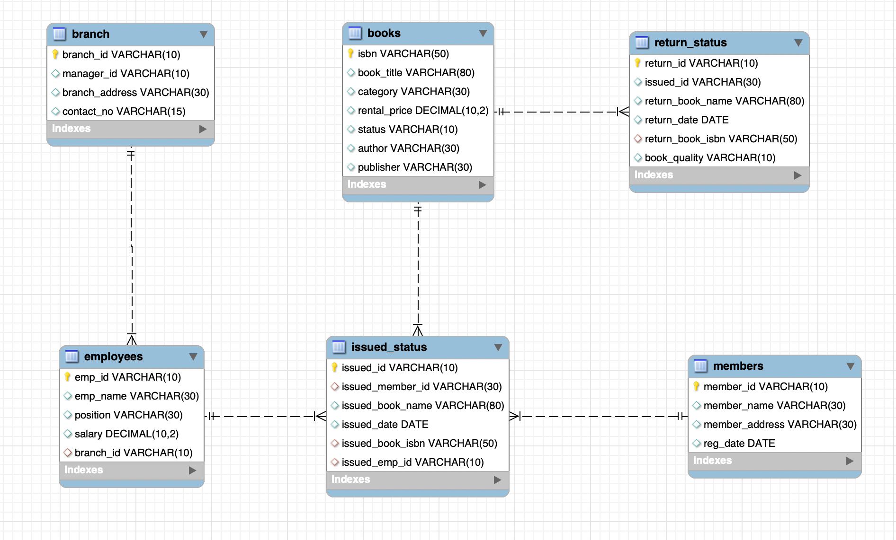

# SQL_library_data_management_project

## Project Overview
**Project Title**: Library Management Analysis  
**Level**: Beginner  
**Database**: `project_2`

This project represents my second hands-on experience with SQL. I worked with a library management dataset to clean the data, explore it, and answer key operational questions to better understand book issuing patterns, overdue returns, and member activity.


## Objectives

1. **Set up the Library Management System Database**: Create and populate the database with tables for branches, employees, members, books, issued status, and return status.
2. **CRUD Operations**: Perform Create, Read, Update, and Delete operations on the data.
3. **CTAS (Create Table As Select)**: Utilize CTAS to create new tables based on query results.
4. **Advanced SQL Queries**: Develop complex queries to analyze and retrieve specific data.

## Project Structure

### 1. Database Setup



- **Database Creation**: Created a database named `project_2`.
- **Table Creation**: Created tables for branches, employees, members, books, issued status, and return status. Each table includes relevant columns and relationships.
```sql
CREATE DATABASE project_2;


CREATE TABLE branch
(
            branch_id VARCHAR(10) PRIMARY KEY,
            manager_id VARCHAR(10),
            branch_address VARCHAR(30),
            contact_no VARCHAR(15)
);


-- Create table "Employee"

CREATE TABLE employees
(
            emp_id VARCHAR(10) PRIMARY KEY,
            emp_name VARCHAR(30),
            position VARCHAR(30),
            salary DECIMAL(10,2),
            branch_id VARCHAR(10),
            FOREIGN KEY (branch_id) REFERENCES  branch(branch_id)
);


-- Create table "Members"

CREATE TABLE members
(
            member_id VARCHAR(10) PRIMARY KEY,
            member_name VARCHAR(30),
            member_address VARCHAR(30),
            reg_date DATE
);


-- Create table "Books"

CREATE TABLE books
(
            isbn VARCHAR(50) PRIMARY KEY,
            book_title VARCHAR(80),
            category VARCHAR(30),
            rental_price DECIMAL(10,2),
            status VARCHAR(10),
            author VARCHAR(30),
            publisher VARCHAR(30)
);


-- Create table "IssueStatus"

CREATE TABLE issued_status
(
            issued_id VARCHAR(10) PRIMARY KEY,
            issued_member_id VARCHAR(30),
            issued_book_name VARCHAR(80),
            issued_date DATE,
            issued_book_isbn VARCHAR(50),
            issued_emp_id VARCHAR(10),
            FOREIGN KEY (issued_member_id) REFERENCES members(member_id),
            FOREIGN KEY (issued_emp_id) REFERENCES employees(emp_id),
            FOREIGN KEY (issued_book_isbn) REFERENCES books(isbn) 
);


-- Create table "ReturnStatus"

CREATE TABLE return_status
(
            return_id VARCHAR(10) PRIMARY KEY,
            issued_id VARCHAR(30),
            return_book_name VARCHAR(80),
            return_date DATE,
            return_book_isbn VARCHAR(50),
            FOREIGN KEY (return_book_isbn) REFERENCES books(isbn)
);

```
### 2. CRUD Operations

- **Create**: Inserted sample records into the `books` table.
- **Read**: Retrieved and displayed data from various tables.
- **Update**: Updated records in the `employees` table.
- **Delete**: Removed records from the `members` table as needed.

**Task 1. Create a New Book Record**
-- "978-1-60129-456-2', 'To Kill a Mockingbird', 'Classic', 6.00, 'yes', 'Harper Lee', 'J.B. Lippincott & Co.')"

```sql
insert into books 
values ("978-1-60129-456-2", "To Kill a Mockingbird", "Classic", 6.00, "yes", "Harper Lee", "J.B. Lippincott & Co.");
```
**Task 2: Update an Existing Member's Address**

```sql
update members
set member_address = "111 anasi St"
where member_id = "C101";
select * from members;
```

**Task 3: Delete a Record from the Issued Status Table**
-- Objective: Delete the record with issued_id = 'IS104' from the issued_status table.

```sql
select * from issued_status;

delete from issued_status
where issued_id = "IS121";
```

**Task 4: Retrieve All Books Issued by a Specific Employee**
-- Objective: Select all books issued by the employee with emp_id = 'E101'.
```sql
select * from books ;

select * from issued_status
where issued_emp_id = "E101";

SELECT issued_emp_id, issued_date,issued_book_name,isbn 
FROM issued_status
JOIN books
ON issued_status.issued_book_isbn = books.isbn
WHERE issued_status.issued_emp_id = 'E101';
```


**Task 5: List Members Who Have Issued More Than One Book**
-- Objective: Use GROUP BY to find members who have issued more than one book.
-- ### 3. CTAS (Create Table As Select)

```sql

create table loyal_members
as select issued_member_id, count(*) as total_books
from issued_status
group by issued_member_id
having count(*)>1;
select * from loyal_members;
```
### 3. CTAS (Create Table As Select)

- **Task 6: Create Summary Tables**: Used CTAS to generate new tables based on query results - each book and total book_issued_cnt**

```sql
create table books_issued_summary
as select issued_book_isbn,issued_book_name, count(*) as book_issed_cnt
from issued_status 
group by issued_book_isbn, issued_book_name;
select * from books_issued_summary;
-- alternative solution instructor guided
select 
      b.isbn,
      b.book_title,
      count(ist.issued_id) as no_issed
from books as b
join 
issued_status as ist 
on ist.issued_book_isbn = b.isbn
group by isbn, book_title;
```


### 4. Data Analysis & Findings

The following SQL queries were used to address specific questions:

Task 7. **Retrieve All Books in a Specific Category**:

```sql
select book_title, category 
from books 
where category = "fiction";
```

8. **Task 8: Find Total Rental Income by Category**:

```sql
select b.category, 
	   sum(b.rental_price),
       count(*)
from books as b
join
issued_status as ist
on ist.issued_book_isbn = b.isbn
group by category with rollup;
```

9. **List Members Who Registered in the Last 1700 Days**:
```sql
select * from members
where reg_date > curdate() - interval 1700 day;
```

10. **List Employees with Their Branch Manager's Name and their branch details**:

```sql
select e1.emp_id,
       e1.emp_name, 
       e1.position, 
       e1.salary, 
       b.*, 
       e2.emp_name as manager
from employees as e1
join 
branch as b
on b.branch_id = e1.branch_id
join 
employees as e2
on b.manager_id = e2.emp_id;
```

Task 11. **Create a Table of Books with Rental Price Above a Certain Threshold**:
```sql
create table expensive_books as
select * from books 
where rental_price > 5;
```

Task 12: **Retrieve the List of Books Not Yet Returned**
```sql
select distinct i.issued_book_name
from issued_status as i 
left join return_status as r 
on i.issued_id = r.issued_id
where r.issued_id is null;
```


## Advanced SQL Operations

**Task 13: Identify Members with Overdue Books**  
Write a query to identify members who have overdue books (assume a 30-day return period). Display the member's_id, member's name, book title, issue date, and days overdue.

```sql
SELECT 
    ist.issued_member_id,
    m.member_name,
    bk.book_title,
    ist.issued_date,
    date("2024-04-12") - ist.issued_date AS overdue_days
FROM issued_status AS ist
JOIN members AS m
    ON m.member_id = ist.issued_member_id
JOIN books AS bk
    ON bk.isbn = ist.issued_book_isbn
LEFT JOIN return_status AS rs
    ON rs.issued_id = ist.issued_id
WHERE rs.return_date IS NULL
    AND (DATE("2024-04-12") - ist.issued_date) > 30
ORDER BY issued_date;

```


**Task 14: Update Book Status on Return**  
Write a query to update the status of books in the books table to "Yes" when they are returned (based on entries in the return_status table).


```sql

delimiter //
     create procedure add_return_records(
				in p_return_id varchar(10), 
				in p_issued_id varchar(10),
                in p_book_quality varchar(10))
begin 
     declare v_isbn varchar(50);
     declare v_book_name varchar(80);
     
     insert into return_status ( return_id, issued_id, return_date, book_quality)
     values (p_return_id, p_issued_id, current_date, p_book_quality);

     select issued_book_isbn,
			issued_book_name
            into 
            v_isbn,
            v_book_name
	 from issued_status
     where issued_id = p_issued_id;
     
     update books
     set status = "yes"
     where isbn = v_isbn;
     
     select concat ("thank you for returning the book: ", v_book_name) as message;
     
end//
delimiter ;
     
CALL add_return_records('RS138', 'IS135', 'Good');

select * from books
where isbn = "978-0-307-58837-1"
```


**Task 15: Branch Performance Report**  
Create a query that generates a performance report for each branch, showing the number of books issued, the number of books returned, and the total revenue generated from book rentals.

```sql
create table branch_reports 
as 
select 
 b.branch_id,
 b.manager_id,
 count(ist.issued_id) as number_book_issued,
 count(rs.return_id) as number_of_book_return,
 sum(bk.rental_price) as total_revenue
from issued_status as ist 
join employees as e 
on e.emp_id = ist.issued_emp_id
join branch as b 
on e.branch_id = b.branch_id
left join return_status as rs
on rs.issued_id = ist.issued_id
join books as bk 
on ist.issued_book_isbn = bk.isbn
group by b.branch_id, b.manager_id;
select * from branch_reports;
```

**Task 16: CTAS: Create a Table of Active Members**  
Use the CREATE TABLE AS (CTAS) statement to create a new table active_members containing members who have issued at least one book in the last 6 months.
```sql
create table active_members
as 
select * from issued_status
where issued_member_id in (select 
				 distinct issued_member_id
                 from issued_status
                 where issued_date>= date ("2024-03-20"));
select * from active_members;


```


**Task 17: Find Employees with the Most Book Issues Processed**  
Write a query to find the top 3 employees who have processed the most book issues. Display the employee name, number of books processed, and their branch.

```sql
select emp_name, count(ist.issued_emp_id) as number_of_books_processed, em.branch_id
from issued_status as ist 
join employees as em
on em.emp_id = ist.issued_emp_id
GROUP BY ist.issued_emp_id, em.emp_name, em.branch_id
order by number_of_books_processed desc
limit 3;
select * from issued_status;
SELECT 
    e.emp_name,
    b.*,
    COUNT(ist.issued_id) as no_book_issued
FROM issued_status as ist
JOIN
employees as e
ON e.emp_id = ist.issued_emp_id
JOIN
branch as b
ON e.branch_id = b.branch_id
GROUP BY 1,2
order by no_book_issued desc
limit 3;
```

**Task 18: Identify Members Issuing High-Risk Books**  
Write a query to identify members who have issued books more than twice with the status "damaged" in the books table. Display the member name, book title, and the number of times they've issued damaged books.    

```sql
update return_status 
set book_quality = "damaged"
where issued_id in ("is109","is111","is112");

select m.member_name, count(*) as damaged
from issued_status as ist
join return_status as r
on  r.issued_id = ist.issued_id
join members as m
on ist.issued_member_id = m.member_id
where book_quality = "damaged"
group by m.member_name, m.member_id
having count(*) > 2;
```
**Task 19: Stored Procedure**
Objective:
Create a stored procedure to manage the status of books in a library system.
Description:
Write a stored procedure that updates the status of a book in the library based on its issuance. The procedure should function as follows:
The stored procedure should take the book_id as an input parameter.
The procedure should first check if the book is available (status = 'yes').
If the book is available, it should be issued, and the status in the books table should be updated to 'no'.
If the book is not available (status = 'no'), the procedure should return an error message indicating that the book is currently not available.

```sql

delimiter //
CREATE PROCEDURE books_status (
    IN p_issued_id VARCHAR(10), 
    IN p_issued_member_id VARCHAR(30), 
    IN p_issued_book_name VARCHAR(80), 
    IN p_issued_book_isbn VARCHAR(50),
    IN p_issued_emp_id VARCHAR(10)
)
BEGIN
    DECLARE v_status VARCHAR(10);

select status into v_status
from books where isbn = p_issued_book_isbn;

if v_status = "yes" then 
insert into issued_status ( issued_id,
							issued_member_id,
                            issued_book_name,
                            issued_date,
                            issued_book_isbn,
                            issued_emp_id
                            )
					values ( p_issued_id,
							p_issued_member_id,
                            p_issued_book_name,
                            curdate(),
                            p_issued_book_isbn,
                            p_issued_emp_id
                            );
update books 
set status = "no"
where isbn = p_issued_book_isbn;

select "book is available" as message;
else 
select "error: book is not available" as message;
end if;

end //
delimiter ;

call books_status('IS156',  'C104',"dune",'978-0-345-39180-3','E109');
CALL books_status('IS134', 'C107', "the diary of a yound girl", '978-0-375-41398-8', 'E106');
-- 978-0-345-39180-3 yes dune
-- 978-0-375-41398-8 no the diary of a yound girl
select * from issued_status;

```


**Task 20: Create Table As Select (CTAS)**
Objective: Create a CTAS (Create Table As Select) query to identify overdue books and calculate fines.

Description: Write a CTAS query to create a new table that lists each member and the books they have issued but not returned within 30 days. The table should include:
    The number of overdue books.
    The total fines, with each day's fine calculated at $0.50.
    The number of books issued by each member.
    The resulting table should show:
    Member ID
    Number of overdue books
    Total fines

```sql
select m.member_id,count(*) as over_due_books, sum((date("2024-04-12") - ist.issued_date)* 0.5) as over_due_fine from 
issued_status as ist 
left join return_status as rs 
on ist.issued_id = rs.issued_id
join members as m
on ist.issued_member_id = m.member_id
where rs.return_date is null 
and (date("2024-04-12") - ist.issued_date) > 30
group by m.member_id;
```

## Reports

- **Database Schema**: Detailed table structures and relationships.
- **Data Analysis**: Insights into book categories, employee salaries, member registration trends, and issued books.
- **Summary Reports**: Aggregated data on high-demand books and employee performance.

## Conclusion

This project demonstrates the application of SQL skills in creating and managing a library management system. It includes database setup, data manipulation, and advanced querying, providing a solid foundation for data management and analysis.
